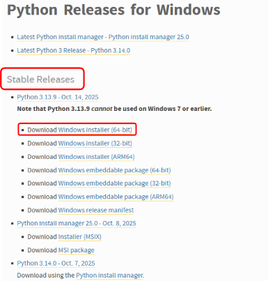
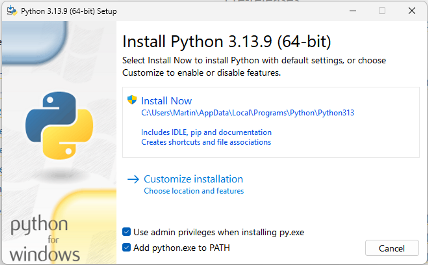

# Windows 11

Esta es mi experiencia instalando y usando Windows 11, lo uso de manera múy básica, si tienes alguna sugerencia o aplicación que consideras que este documento debería tener no dudes en [contactarme](ec4lab@gmail.com)

# Instalación

## Descarga la imagen

## Crear un disco de arranque:
Existes varias herramientas, lo mejor actualmente es ventoy, ya que permite tener un usb con varias imágenes ISO y aún poder utilizarlo para información.

### Instalar ventoy en un usb
Descargar [ventoy](https://sourceforge.net/projects/ventoy/files/v1.1.07/)  
Crear un [usb ventoy](https://www.ventoy.net/en/doc_start.html)  
Copia la imagen descargada dentro del USB ventoy


## Instalar Windows
Con la imagen dentro del usb ventoy, reinicia la pc y asegúrate que bootee desde el usb, esto cambia para cada máquina deberás googlear para la tuya en particular, en algunas es presionando `F8` o `F10` o ingresando directamente al menú de la bios con `supr` o `F2` y cambiando el orden de prioridades del booteo.

## Durante la instalación
Sigue las pantallas y coloca tus preferencias, como usuario, nombre del equipo y contraseña,uso horario, idioma de la instalación y teclado.  


# Instalar aplicaciones

## Instalar python en windows 11
Descargar el instalador de la [web oficial](https://www.python.org/downloads/windows/).

Normalmente lo aconsejable es descargar la última versión estable, pero algunas aplicaciones exigen versiones ligeramente anteriores, solo debes buscar mas abajo el instalador más adecuado.  

[](https://www.python.org/downloads/windows/)  

Recuerda siembre durante la instalación tildar la casilla:  
✅ Add python.exe to PATH  
[](https://www.python.org/downloads/windows/)  


## Instalar git en windows 11
+ Descargar el instalador de la [web oficial](https://git-scm.com/downloads/win)
+ Instalar usando las opciones por defecto.  
    *  **IMPORTANTE** Durante la instalación:  
En el paso ``Adjusting your PATH environment``, seleccionar:  
✅ Git from the command line and also from 3rd-party software  
Eso asegura que git funcione desde PowerShell, CMD o VSCode.
+ Reiniciar VSCode si ya estaba abierto.

## Instalar VSCode em windows 11

### troubleshooting

#### SSecurityException
Si al intentar crear un entorno virtual en el terminal de VSCode tienes el error
+ CategoryInfo : SecurityError: (:) [], PSSecurityException
+ FullyQualifiedErrorId : UnauthorizedAccess

Debes cambiar las políticas de ejecución en PowerShell
En una ventana de Powershell como administrador
```Powershell
Set-ExecutionPolicy RemoteSigned -Scope CurrentUser
# Elegir [S]í si lo solicita
```


# Windows en 1 pen:
https://www.youtube.com/shorts/-u0MlGX4_qw?feature=share

# Windows 10 "Optimizado"
