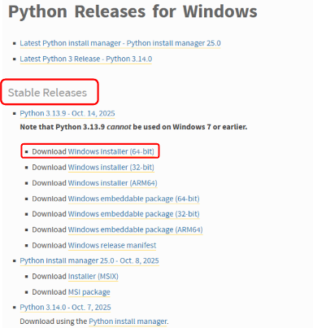
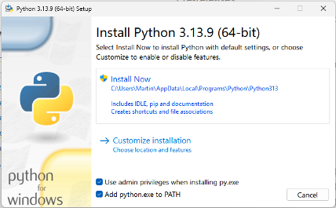

# Windows 11

Esta es mi experiencia instalando y usando Windows 11, lo uso de manera múy básica, si tienes alguna sugerencia o aplicación que consideras que este documento debería tener no dudes en [contactarme](ec4lab@gmail.com)

## Instalación

### Descarga la imagen

### Crear un disco de arranque

Existes varias herramientas, lo mejor actualmente es ventoy, ya que permite tener un usb con varias imágenes ISO y aún poder utilizarlo para información.

### Instalar ventoy en un usb

Descargar [ventoy](https://sourceforge.net/projects/ventoy/files/v1.1.07/)  
Crear un [usb ventoy](https://www.ventoy.net/en/doc_start.html)  
Copia la imagen descargada dentro del USB ventoy

### Instalar Windows

Con la imagen dentro del usb ventoy, reinicia la pc y asegúrate que bootee desde el usb, esto cambia para cada máquina deberás googlear para la tuya en particular, en algunas es presionando `F8` o `F10` o ingresando directamente al menú de la bios con `supr` o `F2` y cambiando el orden de prioridades del booteo.

### Durante la instalación

Sigue las pantallas y coloca tus preferencias, como usuario, nombre del equipo y contraseña,uso horario, idioma de la instalación y teclado.  

## Instalar python en windows 11

Descargar el instalador de la [web oficial](https://www.python.org/downloads/windows/).

Normalmente lo aconsejable es descargar la última versión estable, pero algunas aplicaciones exigen versiones ligeramente anteriores, solo debes buscar mas abajo el instalador más adecuado.  

[](https://www.python.org/downloads/windows/)  

Recuerda siembre durante la instalación tildar la casilla:  

* [x] Add python.exe to PATH  

[](https://www.python.org/downloads/windows/)  

## Instalar git en windows 11

* Descargar el instalador de la [web oficial](https://git-scm.com/downloads/win)
* Instalar usando las opciones por defecto.  
  
**IMPORTANTE** Durante la instalación:  

En el paso ``Adjusting your PATH environment``, seleccionar:  

* [x] Git from the command line and also from 3rd-party software  

Eso asegura que git funcione desde PowerShell, CMD o VSCode.

> [!TIP]
> Reiniciar VSCode si ya estaba abierto.

## Instalar ffmpeg en windows 11

Descargar [FFmpeg](<https://www.gyan.dev/ffmpeg/builds/>)  
`ffmpeg-release-essentials.zip` Esta versión es suficiente y más liviana  
`ffmpeg-git-full.7z` Version Completa  

Descomprimir el archivo, por ejemplo en:

```Powershell
C:\ffmpeg
```

Dentro quedará algo así:

```Powershell
C:\ffmpeg
 └── ffmpeg-7.x-essentials_build
      └── bin
          ├── ffmpeg.exe
          ├── ffprobe.exe
          └── ffplay.exe
```

Copiar la dirección:

```Powershell
C:\ffmpeg\ffmpeg-7.x-essentials_build\bin
```

Agregar al PATH

* Inicio
  * Escribir `variables de entorno`
    * abrir `Editar las variables de entorno del sistema`
      * Click en `Variables de entorno`

Buscar y editar la variable PATH (Sistema):

* Path
  * Click en Editar
    * Click en Nuevo

Agregar:

```text
C:\ffmpeg\ffmpeg-7.x-essentials_build\bin
```

Aceptar todo.

Verificar que funciona, en una ventana de powershell`

```Powershell
ffmpeg -version
# Salida: ffmpeg version 7.x...
```

## Instalar Exiftool en windows 11

Descargar [Exiftool](<https://exiftool.org/>)  
`64-bit: exiftool-13.57_64.zip` O la versión actual

Descomprimir el archivo, por ejemplo en:

```Powershell
C:\exiftool
```

Dentro quedará algo así:

```Powershell
C:\exiftool
 └── exiftool-13.57_64
      └── exiftool_files
      |    ├── ...
      |    ├── ...
      |    └── ...
      └── exiftool(-k).exe
```

>[!IMPORTANT]
>Renombrar `exiftool(-k).exe` a `exiftool.exe`, para evitar problemas de compatibilidad con UBUNTU

Copiar la dirección (Ojo a la versión):

```text
C:\exiftool\exiftool-13.57_64
```

Agregar al PATH

* Inicio
  * Escribir `variables de entorno`
    * abrir `Editar las variables de entorno del sistema`
      * Click en `Variables de entorno`

Buscar y editar la variable PATH (Sistema):

* Path
  * Click en Editar
    * Click en Nuevo

Agregar:

```text
C:\exiftool\exiftool-13.57_64
```

Aceptar todo.

Verificar que funciona, en una ventana de  `powershell`

```Powershell
exiftool -ver
# Salida: 13.57
```

## Instalar VSCode em windows 11

### troubleshooting

#### SSecurityException

Si al intentar crear un entorno virtual en el terminal de VSCode tienes el error

```powershell
CategoryInfo : SecurityError: (:) [], PSSecurityException
FullyQualifiedErrorId : UnauthorizedAccess
```

Debes cambiar las políticas de ejecución, en una ventana de `Powershell` como administrador

```Powershell
Set-ExecutionPolicy RemoteSigned -Scope CurrentUser
# Elegir [S]í si lo solicita
```

## Windows en 1 pen

<https://www.youtube.com/shorts/-u0MlGX4_qw?feature=share>

## Windows 10 "Optimizado"

<https://revi.cc/>

<https://youtube.com/shorts/4boFoLz7ZLI>
<https://youtube.com/shorts/UntjJYgyKyc>
<https://youtube.com/shorts/3t1QryNAtik>

## Ver tamaño de archivos

<https://windirstat.net/>

## Cómo ELIMINAR "Mostrar más opciones" del clic derecho, y ver menu contextual clásico en Windows 11

[Fuente](https://www.reddit.com/r/microsoft/comments/sv88tb/how_to_remove_show_more_options_from_windows_11/?tl=es-419)

Para dejar por defecto el menú clásico: abrir una ventana de powershell

```powershell
reg.exe add "HKCU\Software\Classes\CLSID\{86ca1aa0-34aa-4e8b-a509-50c905bae2a2}\InprocServer32" /f /ve
```

Para restaurar "Mostrar más opciones": abrir una ventana de powershell

```powershell
reg.exe delete "HKCU\Software\Classes\CLSID\{86ca1aa0-34aa-4e8b-a509-50c905bae2a2}" /f
```

>[!TIP]
>A mi me funcionó entrando a powershell como administrador, algunos usuarios reportan que no funciona así, pero si entrando como usuario regular.

## Limpieza de archivos del sistema

Si el sistema se pone lento es posible reparar la imagen de Windows.  
Abrir como administrador una ventana de `cmd` o `powershell` y ejecutar:

```powershell
DISM /Online /Cleanup-Image /RestoreHealth
```

>[!NOTE]
>Este proceso puede tardar hasta 20 minutos y parecer estancado en el 20%, déjalo continuar hasta que finalice.

Escanear archivos del sistemaUna vez terminado el comando anterior:

```powershell
sfc /scannow
```

Esperar a que llegue al 100% y reiniciar la PC.

## Carpeta WinSxS ocupa mucho espacio

Antes de aplicar el siguiente comando se recomienda primero realizar la limpieza de archivos del sistema, luego de reiniciar abrir como administrador una ventana de `cmd` o `powershell` y ejecutar:

```powershell
DISM /Online /Cleanup-Image /StartComponentCleanup
```

Se puede ejecutar el comando con la opción `ResetBase`, esto hace una limpieza más profunda, pero es irreversible, es decir, elimina la posibilidad de volver a actualizaciones anteriores. Debes estar seguro que el sistema funciona de manera estable desde la última actualización.

```powershell
dism.exe /Online /Cleanup-Image /StartComponentCleanup /ResetBase
```
